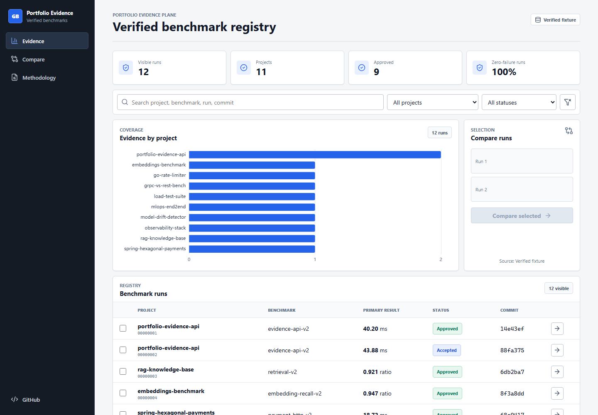
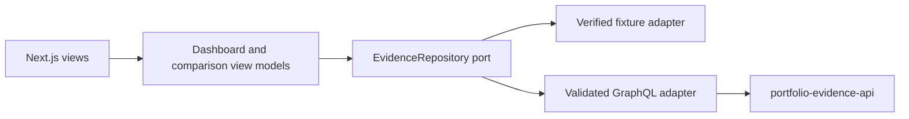
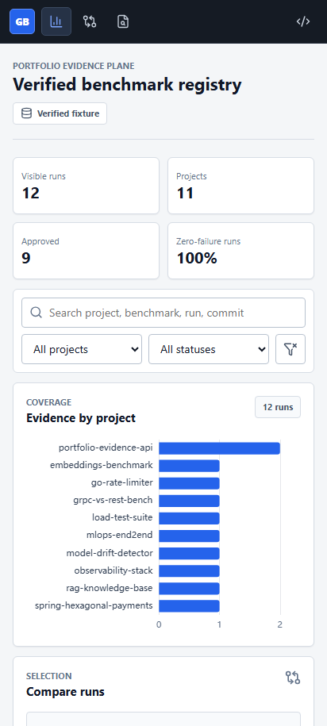

# #32 portfolio-evidence-console

**Proves:** a responsive Next.js console can render, filter, compare, and explain verified benchmark evidence while keeping domain policy independent from React and GraphQL.

**Benchmark:** `filter_to_chart_p95_ms = 45.996 ms` from 30 measured Chromium interactions after 5 warmups; zero failed interactions on clean source `868bbb8`.



## What This Solves

Benchmark JSON is useful to machines but slow for a reviewer to inspect. This console turns the read contract from [`portfolio-evidence-api`](https://github.com/Brilhante29/portfolio-evidence-api) into four concrete workflows: scan evidence, filter runs, compare compatible results, and audit provenance.

The default path uses a deterministic verified fixture. Set `EVIDENCE_API_URL` to switch the same `EvidenceRepository` port to live GraphQL; views and application policy do not change.

## Run With Docker

```bash
docker build -t portfolio-evidence-console .
docker run --rm -p 3000:3000 portfolio-evidence-console
```

Open `http://localhost:3000`. Health is exposed at `GET /api/health`.

## Benchmark

```bash
npm ci
npm run build
npx playwright install chromium
npm run benchmark
```

| Metric                   |        Result |     Gate | Direction       |
| ------------------------ | ------------: | -------: | --------------- |
| Filter to chart p95      |     45.996 ms | < 120 ms | lower is better |
| Largest Contentful Paint |        696 ms |   report | lower is better |
| Cumulative Layout Shift  |        0.0859 |   < 0.10 | lower is better |
| Next static transfer     | 318,437 bytes |   report | lower is better |

The harness writes `benchmarks/results/latest.json` and a V2 publication artifact with workload, environment, command, clean commit, dependency lock, image, and artifact digests. CI executes only a bounded calibration so it cannot overwrite publication evidence.

## Architecture



This is a modular monolith with MVVM-style vertical slices. Domain formatting and comparison rules import no React, Next.js, fetch, browser, or GraphQL code. The composition root selects an adapter; Zod fails closed at the live boundary. See [`sdd/architecture-decision.md`](sdd/architecture-decision.md).

## Product Routes

| Route                     | Purpose                                              |
| ------------------------- | ---------------------------------------------------- |
| `/`                       | evidence registry, filters, chart, two-run selection |
| `/compare?runs=<id>,<id>` | contract-aware delta comparison                      |
| `/runs/<id>`              | execution, workload, and provenance audit            |
| `/methodology`            | publication and comparability controls               |

## Quality Evidence

- 14 unit/contract tests; 99.13% statements, 97.43% branches, 100% functions.
- Six Playwright workflows across desktop/mobile, including chart redraw and viewport containment.
- Screenshot harness rejects blank canvases and horizontal viewport scroll.
- Node 24 non-root multi-stage Docker runtime with no secret or external service by default.
- GitHub Actions pins checkout/setup-node by commit and runs format, lint, typecheck, coverage, build, E2E, calibration, audit, project validation, Docker build, and health smoke.



## Decisions

- GraphQL fits the nested read model; REST aggregation and mutations add no value here.
- Apollo, Redux, BFF, database, broker, microfrontends, cloud, and auth are rejected until a measured product force exists.
- TypeScript 6.0.3 and ESLint 9.39.5 are deliberate ecosystem compatibility pins; the tested next majors currently violate Next's lint dependencies.
- Cloud is absent. If a future AWS capability appears, it must enter behind a port and prove local parity with [`sivchari/kumo`](https://github.com/sivchari/kumo) first.

## Reuse

The repository was generated and governed by [`portfolio-reuse-kit`](https://github.com/Brilhante29/portfolio-reuse-kit). Vendored contracts are checksum-pinned in `contracts/manifest.json`; project-specific views and domain policy remain here. Reusable findings are tracked in [`sdd/reuse-improvement-review.md`](sdd/reuse-improvement-review.md).

See [`REFERENCES.md`](REFERENCES.md) for dependency licenses and reuse provenance.
