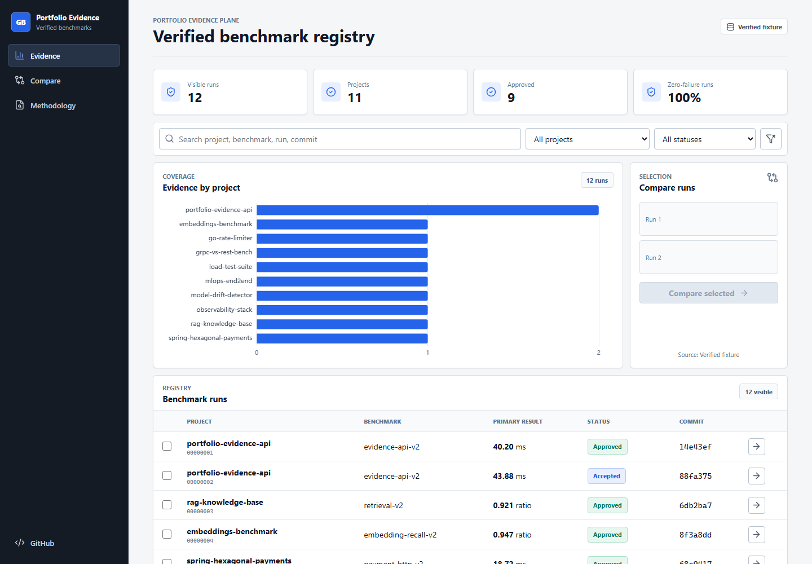
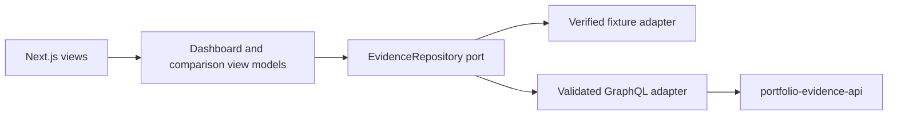
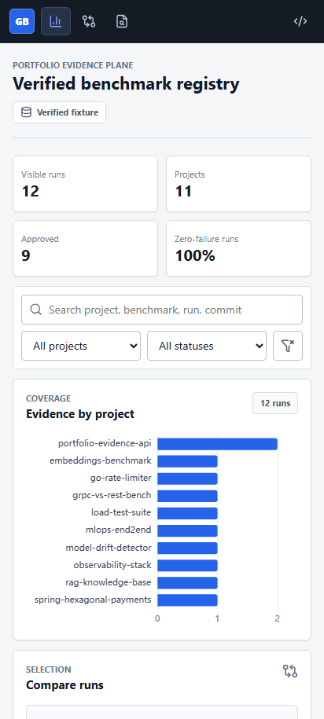

# Portfolio Evidence Console: Verified Benchmark Evidence for Human Reviewers

**`filter_to_chart_p95_ms = 41.72 ms`** from 30 measured Chromium interactions after 5 warm-ups, with zero failed interactions on clean source `f887d21`. A responsive Next.js console renders, filters, compares, and explains verified benchmark evidence while domain policy stays independent from React and GraphQL.

[](https://github.com/Brilhante29/portfolio-evidence-console/actions/workflows/ci.yml)
[](LICENSE)
  



## Why this exists

Benchmark JSON is useful to machines but slow for a reviewer to inspect. This console turns the read contract from [`portfolio-evidence-api`](https://github.com/Brilhante29/portfolio-evidence-api) into four concrete workflows: scan evidence, filter runs, compare compatible results, and audit provenance.

The default path uses a deterministic verified fixture. Set `EVIDENCE_API_URL` to switch the same `EvidenceRepository` port to live GraphQL; views and application policy do not change.

## Results

| Metric                   |        Result |     Gate | Direction       |
| ------------------------ | ------------: | -------: | --------------- |
| Filter to chart p95      |      41.72 ms | < 120 ms | lower is better |
| Largest Contentful Paint |        372 ms |   report | lower is better |
| Cumulative Layout Shift  |        0.0859 |   < 0.10 | lower is better |
| Next static transfer     | 318,437 bytes |   report | lower is better |

**How to read it:** the primary metric is the time from applying a filter to the redrawn chart, measured over 30 real Chromium interactions; the gate fails the run above 120 ms. Largest Contentful Paint and transfer size are reported for context, not gated. The harness writes `benchmarks/results/latest.json` and a V2 publication artifact with workload, environment, command, clean commit, dependency lock, image, and artifact digests.

## Quickstart

```bash
docker build -t portfolio-evidence-console .
docker run --rm -p 3000:3000 portfolio-evidence-console
```

Open `http://localhost:3000`. Health is exposed at `GET /api/health`.

## How it works


```mermaid
flowchart LR
  V[Next.js views] --> VM[Dashboard and comparison view models]
  VM --> P[EvidenceRepository port]
  P --> F[Verified fixture adapter]
  P --> G[Validated GraphQL adapter]
  G --> A[portfolio-evidence-api]
```

This is a modular monolith with MVVM-style vertical slices. Domain formatting and comparison rules import no React, Next.js, fetch, browser, or GraphQL code. The composition root selects an adapter; Zod fails closed at the live boundary. See [`sdd/architecture-decision.md`](sdd/architecture-decision.md).

### Product routes

| Route                     | Purpose                                              |
| ------------------------- | ---------------------------------------------------- |
| `/`                       | evidence registry, filters, chart, two-run selection |
| `/compare?runs=<id>,<id>` | contract-aware delta comparison                      |
| `/runs/<id>`              | execution, workload, and provenance audit            |
| `/methodology`            | publication and comparability controls               |

## Design decisions

| Decision                                  | Why                                                                                                                                    | Rejected                                                                                                                   |
| ----------------------------------------- | -------------------------------------------------------------------------------------------------------------------------------------- | -------------------------------------------------------------------------------------------------------------------------- |
| GraphQL reads                             | The published read contract already matches nested dashboard and comparison reads                                                      | REST aggregation                                                                                                           |
| MVVM-style slices in a modular monolith   | Rich filter, selection, chart, and comparison state, while domain evidence and transport adapters stay replaceable                     | MVC (does not make view state and transport substitution explicit); microfrontends (one product, one team, one deployment) |
| Server reads with page-local state        | The initial view renders on the server and interaction stays local to each page                                                        | Apollo Client or Redux: normalized caching and another state layer without a measured need                                 |
| Next.js                                   | Server rendering for the initial evidence view plus rich client filtering and comparison                                               | Angular, reserved for a command-heavy operations console                                                                   |
| TypeScript 6.0.3 and ESLint 9.39.5 pinned | The tested next majors currently violate Next's lint dependencies                                                                      | Unpinned latest majors                                                                                                     |
| No cloud dependency                       | A future AWS capability must enter behind a port and prove local parity with [`sivchari/kumo`](https://github.com/sivchari/kumo) first | Cloud SDKs in the product path                                                                                             |

A BFF, database, broker, and authentication are also out until a measured product force exists.

## Testing

- 14 unit and contract tests; 99.13% statements, 97.43% branches, 100% functions.
- Six Playwright workflows across desktop and mobile, including chart redraw and viewport containment.
- The screenshot harness rejects blank canvases and horizontal viewport scroll.
- A Node 24 non-root multi-stage Docker runtime with no secret or external service by default.
- GitHub Actions pins checkout and setup-node by commit and runs format, lint, typecheck, coverage, build, E2E, calibration, audit, project validation, Docker build, and health smoke.



## Limitations

- The default path renders a deterministic verified fixture; live data needs a running [`portfolio-evidence-api`](https://github.com/Brilhante29/portfolio-evidence-api).
- The interaction benchmark runs in local Chromium; it is not field Core Web Vitals data.
- The console is read-only and has no authentication.

## Reproducibility

```bash
npm ci
npm run build
npx playwright install chromium
npm run benchmark
```

The benchmark writes `benchmarks/results/latest.json` and the V2 publication artifact. CI executes only a bounded calibration, so it cannot overwrite publication evidence.

## Project structure

```text
src/app/              Next.js routes, health endpoint, error pages
src/features/         dashboard and comparison view models and views
src/application/      evidence analysis and the EvidenceRepository port
src/domain/           evidence formatting and comparison rules
src/infrastructure/   fixture and validated GraphQL adapters, composition root
tests/e2e/            Playwright workflows
benchmarks/           interaction benchmark, results, V2 publication record
contracts/            checksum-pinned vendored contracts
screenshots/          desktop, mobile, and comparison captures
```

## How this repository is built

The project was generated and is governed by [portfolio-reuse-kit](https://github.com/Brilhante29/portfolio-reuse-kit). Requirements and decisions live in [`sdd/`](sdd) and [`openspec/`](openspec), and [`project.yaml`](project.yaml) records the architecture, stack, and rejected alternatives. Vendored contracts are checksum-pinned in [`contracts/manifest.json`](contracts/manifest.json); reusable findings are tracked in [`sdd/reuse-improvement-review.md`](sdd/reuse-improvement-review.md). Development is AI-assisted and human-governed: [`AGENTS.md`](AGENTS.md) and [`CLAUDE.md`](CLAUDE.md) hold the coding-agent instructions, while tests, validators, and CI decide what gets published.

## Related work

- [portfolio-evidence-api](https://github.com/Brilhante29/portfolio-evidence-api): the REST and GraphQL service this console reads.
- [portfolio-reuse-kit](https://github.com/Brilhante29/portfolio-reuse-kit): the standard that produces the evidence.

See [`REFERENCES.md`](REFERENCES.md) for dependency licenses and reuse provenance.

## Author

**Guilherme Brilhante**, software engineer working on scalable backends and production AI.
[LinkedIn](https://www.linkedin.com/in/guilhermefreirebrilhanteseveriano/) · [GitHub](https://github.com/Brilhante29) · [Publications](https://dblp.org/pid/353/6812.html)

## License

[MIT](LICENSE).
